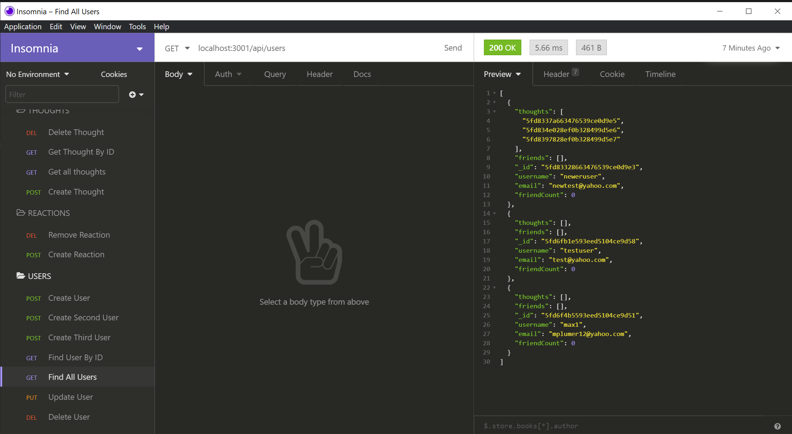

# social-network-api# social-network-api

## Description 
Social Network API is a NoSQL database application designed to allow users to share thoughts, as well as reactions to those thoughts. 

### User Story
* AS A social media startup
* I WANT an API for my social network that uses a NoSQL database
* SO THAT my website can handle large amounts of unstructured data

## Table of Contents
* [Installation](#installation) 
* [Usage](#usage) 
* [Contributing](#contributing)
* [Questions](#questions)

## Link to Github Repository
* [social-network-api](https://github.com/mplumer/social-network-api)

 
### Installation
  Clone or fork the code from the social-network-api repository on GitHub. Open the code in a standard code editing application, such as VS Code. Install npm and the following dependencies: 
  * express
  * MongoDB
  * mongoose

### Usage
 Type npm start in the terminal and press enter to start the server. Use Insomnia Core to test routes using schemas from the models folder.

### License
  MIT
### Contributing
Social Network API is an open source project, and anyone is encouraged to contribute by cloning or forking the code and working to improve its function and versatility.

### Questions
    
##### Interested in other projects from this developer? Visit the following GitHub page:
https://github.com/mplumer
    
##### Send any questions to the following email address:
mplumer12@yahoo.com

##### Walkthrough video:
Links
  * https://drive.google.com/file/d/1YyJL6-pCfO7-9ABOVGg1iDutjb2gkl37/view
  * https://drive.google.com/file/d/10obvR5v86RFQ3d_n8exKIS4kAWGBaXlX/view

 